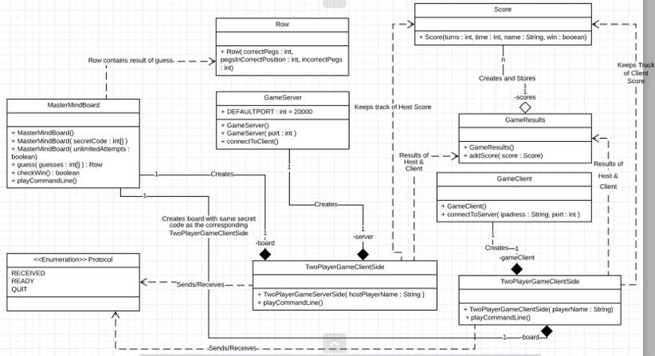
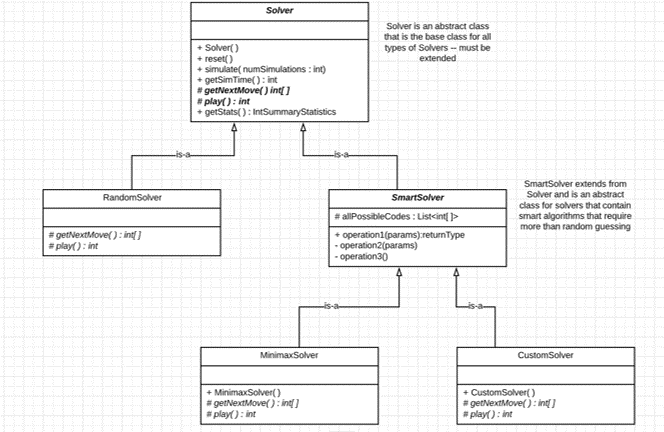

<h4>Team Members:</h4>
Sebastian Ascoli
 
Jonathan Basom
 
 

<h4> External Resources Used </h4>
<a href="https://docs.oracle.com/javase/tutorial/networking/index.html.">
Oracle's tutorial on networking
</a>
 
<a href="https://learning.oreilly.com/library/view/tcpip-sockets-in/9780080568782/ch02.html">
TCP/IP Sockets in Java by Michael J. Donahoo, Kenneth L. Calvert
</a>
 
<a href="https://stackoverflow.com/questions/1073919/how-to-convert-int-into-listinteger-in-java">
StackOverflow.com - How to convert int[] into List&lt;Integer&gt; in Java?
</a>
 
<a href="https://stackoverflow.com/questions/4662215/how-to-extract-a-substring-using-regex">
Stack Overflow Reference on Regex
</a>
 
<a href="https://puzzling.stackexchange.com/questions/546/clever-ways-to-solve-mastermind">
Stackexchange discussion on Mastermind algorithms
</a>
 
<a href="https://github.com/nattydredd/Mastermind-Five-Guess-Algorithm/blob/master/README.md">
GitHub Mastermind-Five-Guess-Algorithm
</a>
 
<a href="https://github.com/nattydredd/Mastermind-Five-Guess-Algorithm/blob/master/Five-Guess-Algorithm.cpp">
GitHub Mastermind-Five-Guess-Algorithm / Five-Guess-Algorithm.cpp
</a>
 

 

The central class for the game is the MasterMindBoard class. This board is an abstraction
for an actual game board where users can play games by making guesses. A MasterMindBoard object can be 
instantiated by 1 of 3 constructors.  The no parameter constructor automatically generates a secret code. The constructor
with a boolean variable as a parameter also generates a secret code, but if the true is passed to this constructor for the
variable unlimitedAttempts, then the user will have unlimited attempts to guess the code.  The third constructor takes an int[]
that contains the secret code instead of generating a random one.  When the user guesses, a Row object is returned that contains
the result of the guess.  The Row contains the number of correct pegs in the correct spot, correct pegs in the incorrect spot,
and incorrect pegs for the guess. In order to play a two player game, the TwoPlayerGameServerSide and TwoPlayerGameClientSide
classes are needed. By using the networking classes described below, the TwoPlayerGameServerSide object establishes a connection
to the client player, creates a secret code, creates and stores a MasterMindBoard with the secret code, and sends the secret code
to the TwoPlayerGameClientSide object so that the client can use the secret code to create and store its own MasterMindBoard 
object. When both the TwoPlayerGameServerSide and TwoPlayerGameClientSide objects are finished playing, they will create their
own Score objects that contain the number of turns, time, player name, and whether or not the player won. Once both the client and
host have finished their games, the host creates a GameResults object that takes both of the Score objects and determines the final
results for both players.  The host then shares the GameResults object with the client as described below in the networking information.

 

The networking classes consist of three primary classes - two classes to represent a server and a client (GameServer and GameClient) and 
one to represent the protocol between them (Protocol).  GameServer has two constructors that can be instantiated.  The first one takes
an int for a port number, and the second does not have any parameters and uses 20000 as the default port number.  The GameServer class
also has the ability to connect to a client (connectToClient) and send and received Protocol and other objects (sendObject and 
readObject).  Another important aspect of GameServer is its getFormattedIP function which returns the IP address so that a client
knows how to connect.  As for the GameClient, there is only one no parameter constructor.  In order to connect to a server, the 
connectToServer method must be called with the server's IP address as a String and the server's port number as an int.

 

